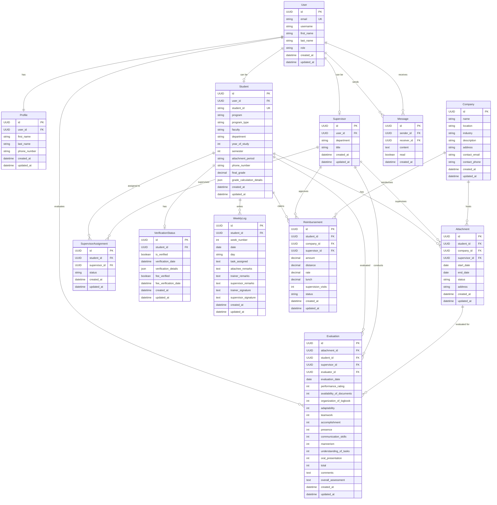

# Student Industrial Attachment Management System - ERD

## Entity Relationship Diagram

## Key Relationships Summary

### Core Entities
- **User**: Base authentication entity with roles (admin, student, supervisor, dean)
- **Profile**: Extended user information (one-to-one with User)
- **Student**: Student-specific information linked to User
- **Supervisor**: Supervisor-specific information linked to User
- **Company**: Organizations hosting attachments

### Process Entities
- **Attachment**: Central entity linking students to companies for industrial attachment
- **SupervisorAssignment**: Manages supervisor-student relationships
- **VerificationStatus**: Tracks student eligibility verification
- **WeeklyLog**: Student's weekly activity reports during attachment
- **Evaluation**: Performance assessments by supervisors/lecturers
- **Reimbursement**: Travel and expense claims
- **Message**: Communication system between users

### Key Business Rules
1. Each User has exactly one Profile
2. Users can have different roles (student, supervisor, admin, dean)
3. Students can have multiple attachments over time
4. Students can be assigned to multiple supervisors
5. Attachments are evaluated by multiple evaluators (lecturers)
6. Final grades are calculated from multiple evaluations (50% each from 2 lecturers)
7. Reimbursements are linked to specific attachments and require supervisor approval
8. Weekly logs track daily activities during attachment period

### Data Integrity Features
- UUID primary keys for all entities
- Soft delete capabilities through status fields
- Audit trails with created_at/updated_at timestamps
- JSON fields for flexible data storage (verification details, grade calculations)
- Foreign key constraints maintaining referential integrity